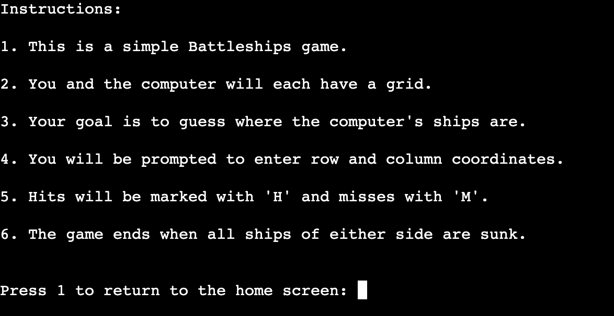

# Battleships! - Project 3

The Battleship Game is an interactive, Python-based console game that brings the classic board game experience to your screen. In this turn-based strategy game, the player competes against an AI-controlled computer opponent, each with their own grid where ships are placed randomly. The objective is to correctly guess the locations of your opponent's hidden ships and sink them before your fleet is destroyed. The game offers a simple yet engaging experience, with features such as input validation, real-time feedback, and a clean, intuitive interface. It’s a fun way to test your strategic thinking and luck!

This project was designed to demonstrate proficiency in Python fundamentals, including the use of loops, conditionals, functions, and classes. It also emphasizes proper coding practices, such as PEP8 compliance and robust input handling, making it a well-rounded programming challenge suitable for all ages.

[Battleships!-Project3](https://battleships-project3-4a1230ee998c.herokuapp.com/)

## Features

- Home Screen: The game features an interactive home screen with options to start the game or view detailed instructions on how to play. It also includes input validation to ensure that only the correct options are selected.

- Player vs. Computer Gameplay: Players compete against a computer opponent, taking turns to guess the location of each other's ships. The game keeps track of both the player's and computer's moves, providing a challenging experience.

- Random Ship Placement: Ships are randomly placed on both the player's and computer's grids at the start of the game, ensuring a unique game experience each time. The placement logic prevents any overlap between ships.

- Real-time Feedback: During gameplay, hits ("H"), misses ("M"), and the status of the ships are displayed in real-time on the grid. This provides clear and immediate feedback to the player about their progress.

### Input Validation:

- Home Screen: Input validation ensures that players can only select valid options (1 or 2) when choosing to start the game or view instructions.

- Player Name: Players must enter a valid name to start the game, ensuring they cannot proceed without providing an appropriate input.

- Coordinate Input: The game validates that players input single-digit row and column values within the grid's range, preventing invalid entries during their turns.

- End Game Menu: Once the game concludes (whether the player wins or loses), an end-game menu is displayed, offering options to either restart the game or return to the home screen. Input validation ensures that players make a valid selection at this stage.

## Game Rules 

- The player and the computer take turns guessing the location of each other's ships.

- The goal is to sink all of the opponent's ships before your own fleet is destroyed.

- Ships are placed randomly on the grid.

- Players are prompted to input row and column values to guess where the opponent's ships are.

- Hits will be marked as "H", misses as "M", and unexplored spots as "O".

## How to Play

- Upon launching, the player is presented with a home screen where they can either start the game or view instructions on how to play.

- After selecting the "Start Game" option, the player is asked to enter their name, and the game begins.

- The player takes turns guessing the location of the computer's ships by entering row and column coordinates, and the computer does the same for the player's grid.

- The game continues until one side sinks all the ships.

## Example Gameplay

### Home Page 

- The home page of the Battleships game displays a welcome message and ASCII art. The player is prompted to choose between two options: "1. Start Game" to begin playing or "2. Instructions" to learn how to play.

- When a player enters an invalid input (anything other than "1" or "2") on the home screen, an error message appears, instructing them to enter either "1" to start the game or "2" to view the instructions.

### Instructions

- The instructions screen provides detailed steps on how to play the Battleships game. It explains the goal, the game rules, and the player's objective. This screen is displayed when the player selects the "Instructions" option from the home page.

- This screenshot shows the input validation feature on the instructions screen. If a player enters an incorrect key (anything other than "1"), an error message prompts them to enter "1" to return to the home screen, ensuring proper input validation and user guidance.

### Enter Name 

- This screen prompts the player to enter their name before starting the game. It ensures that every player provides their name to personalize the game experience.

- This screen shows input validation when the player attempts to start the game without entering a valid name. An error message prompts the player to provide a name, ensuring they do not proceed with an empty or whitespace-only entry.

### Battleships Game 

- This screenshot shows the beginning of the game after the player has entered their name. It displays the player's grid and provides details such as the grid size, the number of ships, and the ship type.

This screenshot demonstrates the input validation for repeated guesses. When the player tries to guess the same coordinates multiple times, an error message appears, instructing them to pick a new location.

- This screenshot shows that the player has entered valid coordinates correctly to play the game. However, the guess results in a "Miss," indicated by the "M" on the grid, showing that no ship was hit. If you manage to guess correctly it will be indicated by a "H" on the grid. You can also see the computers turn with a randomised guess each turn. 
Here is what you would see when you manage to guess correctly:

- These screenshots demonstrates the input validation feature in action. The player has entered coordinates outside the valid range (0-4) or with spaces, and the game displays an error message, prompting them to enter valid coordinates within the grid's boundaries. In the second screenshot It shows that the player has entered coordinates within the grid but has also entered spaces. This ensures a single-digit input so that a player can not enter a space before or after the digit.

- This screenshot appears when the player loses the game. The computer has sunk all the player's ships, and the game ends with a "Game over!" message.

- This screenshot displays the end-of-game screen when the player wins. It congratulates the player for successfully sinking all the computer's ships and winning the game.

- This screenshot demonstrates the input validation feature at the end of the game. If the player enters an invalid key when prompted to either restart the game or return to the home page, an error message appears, instructing them to enter "1" or "2" to make a valid choice.

### Testing Unhidden ships 

- For testing purposes, this screenshot displays the computer's grid with ships unhidden. This feature helps verify ship placements during game development but is not part of the standard gameplay.

## Future Enhancements 

- Two-Player Mode: Add an option that allows two players, who are physically together, to play against each other on the same device. This mode will enable both players to take turns guessing each other’s ship positions, bringing more interactivity to the game.

- Customizable Number of Ships: Allow players to choose the number of ships before starting the game, adding more variety and control over the difficulty level.

- Different Ship Types: Implement different types of ships with varying sizes, which would make the game more strategic and challenging.

- Selectable Grid Sizes: Allow players to choose from different grid sizes, making the game adaptable to different levels of complexity.

## Code Structure 

### BattleshipsGame Class 

This class is the central part of the game, handling all aspects of the gameplay between the player and the computer. It manages game setup, input handling, game logic, and the main game loop.

- __init__: This constructor initializes the game with parameters such as the grid size, the number of ships, the player's name, and the type of ship. It also sets up the player's and computer's grids, randomly places their ships, and initializes lists to track guesses.

- create_grid: Creates and returns an empty game grid (a 2D list) of the specified size, initially filled with "O" to represent unexplored spots.

- place_ships: Responsible for randomly placing a specified number of ships on the grid. It ensures that no two ships occupy the same coordinates.

- display_grid: Displays the current state of the game grid to the player. This method can hide the ship locations on the computer's grid to maintain the game's challenge.

- get_player_guess: This method handles the player's input for row and column coordinates and validates that the input is within the allowed range and not previously guessed.

- check_guess: Checks whether a guess is a hit or miss by comparing it against the list of ship coordinates. It updates the grid accordingly with "H" for hits and "M" for misses.

- check_game_over: Evaluates whether all ships have been sunk, determining if the game has ended.

- computer_turn: Generates a random guess for the computer's turn, ensuring it doesn't select the same spot twice.

- start_game: The main method that manages the game loop, alternating between the player's turn and the computer's turn until one side has sunk all the opponent's ships. It displays relevant messages and updates the grids after each turn.

- end_game_menu: Displays options at the end of the game, prompting the player to either restart or return to the home screen. It provides input validation to ensure valid choices.

- restart_game: Restarts the game using the existing settings without exiting the program. It calls the __init__ method again to reset the game state.

### Standalone Functions

These functions manage aspects outside the main gameplay loop, such as handling the user interface and displaying instructions.

- show_home_page: This function displays the home screen when the game starts, showing options to either start the game or view the instructions. It handles input validation to ensure that players only proceed with valid choices ("1" or "2").

- show_instructions: Provides detailed game instructions to the player, explaining the goal, game rules, and gameplay mechanics. Includes input validation to ensure players return to the home screen by pressing "1".

- clear_console: Clears the console screen for better readability, making the transition between game screens smoother. This is used throughout the program to maintain a clean interface, depending on the operating system.

## Bugs and Fixes

- Invalid Input Handling: Resolved a bug where users could input multiple digits or include spaces before/after the row/column inputs, causing errors and unintended gameplay behavior. The input validation has been added to ensure only single-digit inputs without any spaces are accepted, preventing out-of-bounds guesses and maintaining the integrity of the game. This fix ensures smoother gameplay and prevents players from entering invalid coordinates.

- Player's Grid Displayed Twice: Fixed the issue where the player's grid was displayed twice after each turn, which caused unnecessary clutter and confusion during gameplay. Now, the grid is displayed only once per turn, providing a clearer and more streamlined experience for the player, making it easier to track the progress of the game.

- Input Validation for Player Names: Fixed a bug where players could start the game without entering a name or by entering just whitespaces. The game now ensures that players provide a valid name by repeatedly prompting them until a non-empty, non-whitespace name is entered, enhancing the overall user experience and preventing unintended gameplay starts.

- Input Validation: Resolved an issue where the invalid input message on the home screen would not appear properly when entering an incorrect key. The problem was caused by the clear_console function, which was clearing the screen before the error message could be displayed. Now, the game properly displays the error message and waits for a valid input (1 or 2) before proceeding.

- There are no remaining bugs.

## Validation and Testing

### Flake8 and PEP8

- code has been passed through the pep8 linter and has returned no problems. https://pep8ci.herokuapp.com/

- Code has been run through flake8 in the terminal to ensure it follows PEP8 guidelines, fixing issues with line lengths and formatting.

### Manual Testing

- Home Screen Validation: The home screen was tested to ensure that only '1' or '2' are accepted as valid inputs. Any other input displays an error message, and the user is prompted to try again.

- Player Name Input Validation: Attempted to start the game without entering a name, entering only spaces, and entering a valid name. All invalid attempts were correctly flagged, and the game only proceeded with a valid name.

Game Input Validation:

- Entered various invalid coordinates (e.g., letters, multiple digits, out-of-bound numbers) to ensure that the game correctly rejected these entries.

- Tested repeated guesses, and the game properly displayed an error message for duplicate inputs.

### Game Flow: Played multiple games to verify:

- The player’s turn alternates correctly with the computer’s turn.

- Hits, misses, and the game's end conditions (win/lose) were accurately displayed.

- The game displayed the correct end-game menu, offering the option to restart or return to the home screen.

- Instructions Page: Confirmed that selecting '2' from the home screen displays the instructions. The input validation for returning to the home screen by pressing '1' was also tested and worked correctly.

## Deployment

Deployment
To deploy this Battleship game on Heroku, follow these steps:

-  Fork or Clone the Repository

- Create a New Heroku App
- Log in to Heroku.
- Click "New" > "Create New App".
- Name your app and select your region.

- Set Buildpacks
- Go to the Settings tab on Heroku.
- Under Buildpacks, add Python first, then Node.js.
- create a Config Var called PORT. Set this to 8000

- Link the Repository and Enable Automatic Deploys In the Deploy tab.
- select GitHub as the deployment method.
- Search for your GitHub repository and connect it.
- Click deploy. 

- App is live at: https://battleships-project3-4a1230ee998c.herokuapp.com/

## Credits

- Code institute for the project 3 scope video. 

- [Youtube: Corey Schafer](https://www.youtube.com/watch?v=ZDa-Z5JzLYM) A comprehensive guide on creating classes in Python. 

- [YouTube: How to Fix](https://www.youtube.com/watch?v=Zt1G6AE_7Ks) A helpful guide on resolving issues with lines that exceed the recommended length in Python code.

- [DeftStack](https://www.delftstack.com/howto/python/python-clear-console/#google_vignette) Instructions on how to clear the console in Python.

- [ASCII Art Archive](https://www.asciiart.eu/text-to-ascii-art) Used for adding Battleships! ASCII art to the home page.